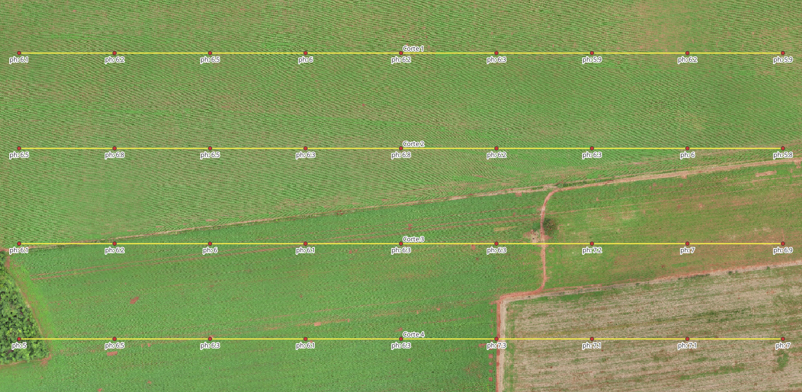
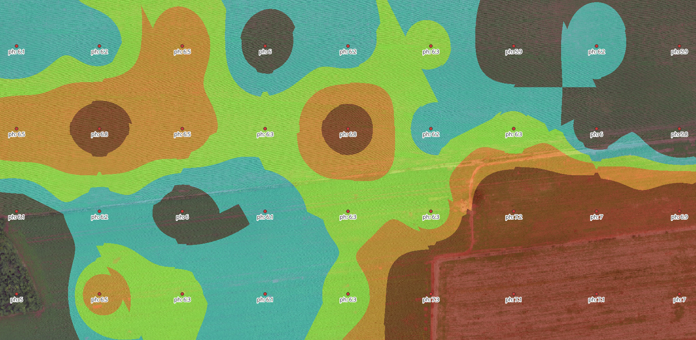
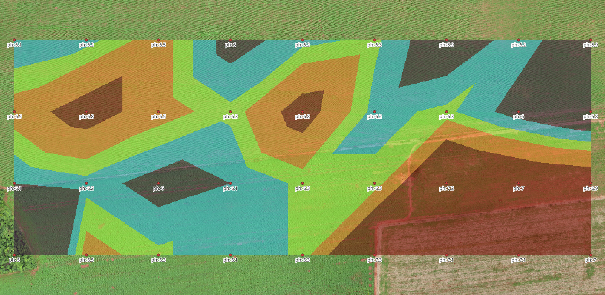
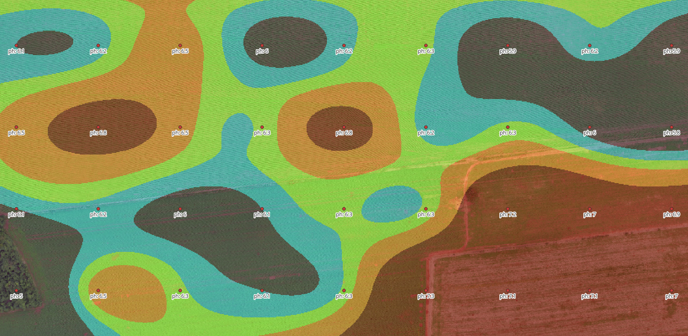

# Advanced RBF Interpolation Plugin

[](https://www.gnu.org/licenses/gpl-3.0)
[](https://qgis.org/)
[](https://python.org/)

Este plugin para QGIS realiza interpolação avançada por **Função de Base Radial (RBF)** com recursos de controle de vizinhança, interpolação local e opções de extrapolação para grandes conjuntos de dados.

## Principais Funcionalidades

- **Interpolação RBF** com escolha de 7 funções:

  - `thin_plate` - Placa fina
  - `multiquadric` - Multiquadrática
  - `inverse_multiquadric` - Multiquadrática inversa
  - `gaussian` - Gaussiana
  - `linear` - Linear
  - `cubic` - Cúbica
  - `quintic` - Quíntica

- **Controle de vizinhança** para interpolação local
- **Métodos de extrapolação** flexíveis
- **Otimização** para grandes volumes de dados
- **Saída raster** georreferenciada com o sistema de cordenadas do dado de entrada

## Parâmetros do Algoritmo

### Parâmetros Obrigatórios

- **Camada de pontos de entrada**: Camada vetorial de pontos a ser interpolada
- **Campo de valor para interpolação**: Campo numérico da camada de pontos
- **Função RBF**: Escolha entre 7 funções de base radial
- **Tamanho da célula de saída**: Resolução do raster gerado (em unidades do CRS)
- **Raster interpolado**: Caminho para salvar o raster de saída

### Parâmetros Opcionais

- **Parâmetro de suavização (smooth)**: Controla o ajuste da superfície interpolada
  - Valores maiores = mais suavização
  - Valores próximos de zero = ajuste mais preciso aos pontos
- **Extensão da interpolação**: Área de interesse para o raster de saída
- **Usar interpolação local**: Ativa o modo local (recomendado para grandes datasets)
- **Número máximo de pontos vizinhos**: Limita pontos usados em cada interpolação local
- **Raio de busca**: Distância máxima para considerar pontos vizinhos
- **Método de extrapolação**:
  - **Nenhum (mantém NaN)**: Áreas fora do convex hull permanecem como NoData
  - **Valor constante**: Preenche áreas sem dados com valor definido
  - **Vizinho mais próximo**: Usa valor do ponto mais próximo
  - **Interpolação linear**: Tenta interpolar linearmente áreas sem dados
- **Valor para extrapolação constante**: Valor a ser usado no método "constante"

## Instalação

### ⚠️ Instalação Manual (Requerida)

Este plugin **não está disponível** no repositório oficial do QGIS e requer instalação manual:

#### 1. Download do Plugin

- **Clone** o repositório: `git clone https://github.com/delanoms/Advanced-RBF-Interpolation.git`
- Ou **baixe** o ZIP do GitHub e extraia os arquivos

#### 2. Instalação no QGIS

Copie a pasta do plugin para o diretório de plugins do QGIS:

**Windows:**

```
C:\Users\[SEU_USUARIO]\AppData\Roaming\QGIS\QGIS3\profiles\default\python\plugins\advanced_rbf_interpolation
```

**Linux:**

```
~/.local/share/QGIS/QGIS3/profiles/default/python/plugins/advanced_rbf_interpolation
```

**macOS:**

```
~/Library/Application Support/QGIS/QGIS3/profiles/default/python/plugins/advanced_rbf_interpolation
```

#### 3. Ativação do Plugin

1. **Reinicie** o QGIS
2. Acesse **Plugins** → **Gerenciar e Instalar Plugins**
3. Na aba **Instalados**, procure por **"Advanced RBF Interpolation"**
4. **Ative** o plugin marcando a caixa de seleção

## Como Usar

1. **Acesse** o algoritmo "Interpolação RBF Avançada" no menu **Processamento** → **Caixa de Ferramentas**
2. **Configure** os parâmetros conforme suas necessidades
3. **Execute** o algoritmo e visualize o raster gerado

## Exemplos Visuais

### Dados de Entrada

A figura abaixo mostra os pontos de amostra com valores de pH e os 4 perfis de corte utilizados para demonstrar as diferentes técnicas de interpolação:



_Pontos de amostra com valores de pH e perfis de corte 1-4 para análise comparativa_

### Comparação de Métodos de Interpolação

#### Interpolação IDW (Inverse Distance Weighting)



_Resultado da interpolação IDW - método determinístico baseado em distância_

#### Interpolação TIN (Triangulated Irregular Network)



_Resultado da interpolação TIN - triangulação linear entre pontos_

#### Interpolação RBF (Radial Basis Function)



_Resultado da interpolação RBF - superfície suave e contínua_

### Análise de Perfis de Corte

Para demonstrar a qualidade da interpolação RBF, foram realizados 4 cortes transversais nos dados interpolados:

#### Corte 1


#### Corte 2


#### Corte 3


#### Corte 4


_Os perfis de corte mostram a continuidade e suavidade da superfície interpolada pelo método RBF, evidenciando sua capacidade de gerar superfícies realistas que respeitam os valores observados nos pontos de controle._

## Exemplos de Uso

### Para Grandes Datasets

- Ative a **interpolação local**
- Ajuste o **número de vizinhos** e **raio de busca**
- Melhora desempenho e reduz uso de memória

### Para Interpolação Global

- Desative a opção de **interpolação local**
- Use todos os pontos disponíveis

### Ajuste de Suavização

- **Valores baixos**: Superfície mais precisa, mas pode ser "ondulada"
- **Valores altos**: Superfície mais suave, ideal para suavizar ruídos

### Extrapolação

- **Método constante**: Útil para preencher áreas fora do convex hull
- **Vizinho mais próximo**: Para manter valores realistas
- **Linear**: Para transições suaves

## Funcionamento Interno

- Utiliza função `interpolate_rbf_advanced` (SciPy + otimizações)
- **Modo local**: KD-Tree para busca eficiente de vizinhos
- **Raster de saída**: Sempre georreferenciado e compatível com QGIS
- **Tratamento de NaN**: Conforme método de extrapolação escolhido
- **Clipping automático**: Evita valores extremos fora do intervalo dos dados

## Requisitos

- **QGIS 3.x** ou superior
- **NumPy** e **SciPy** (já inclusos na instalação padrão do QGIS)
- **GDAL** (já incluso na instalação padrão do QGIS)

## Troubleshooting

### Problemas Comuns

**Plugin não aparece na lista de plugins instalados:**

- Verifique se a pasta foi copiada corretamente para o diretório de plugins
- Certifique-se de que a pasta contém o arquivo `__init__.py`
- Reinicie o QGIS completamente

**Erro ao executar o algoritmo:**

- Verifique se NumPy e SciPy estão instalados
- Confirme que a camada de entrada é válida e contém dados
- Verifique se o campo de valor é numérico

**Problemas de permissão (Linux/macOS):**

- Certifique-se de que o diretório de plugins tem permissões de leitura
- Use `chmod 755` no diretório do plugin se necessário

## Suporte

**Dúvidas e sugestões**: [projetos.delano@gmail.com](mailto:projetos.delano@gmail.com)

## Licença

Este projeto está licenciado sob a **GNU General Public License v3.0** - veja o arquivo [LICENSE](LICENSE) para detalhes.

## Autor

**Delano M. Santos** - [projetos.delano@gmail.com](mailto:projetos.delano@gmail.com)

---

**© 2025 Delano M. Santos** - Todos os direitos reservados conforme a licença GPL v3.
